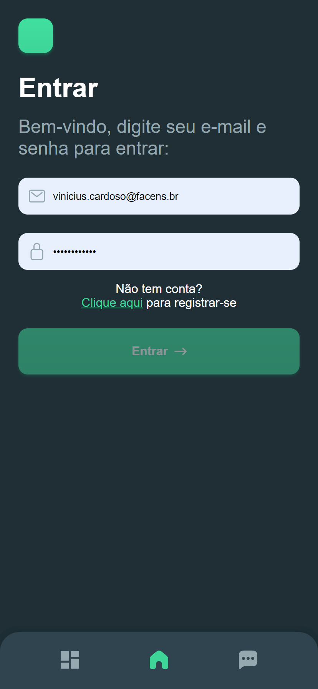
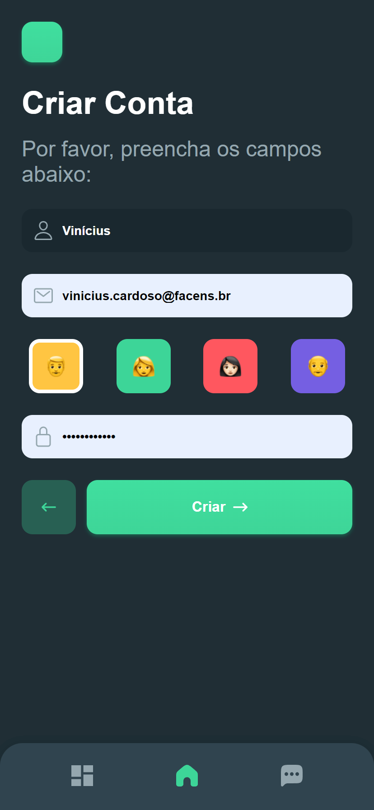
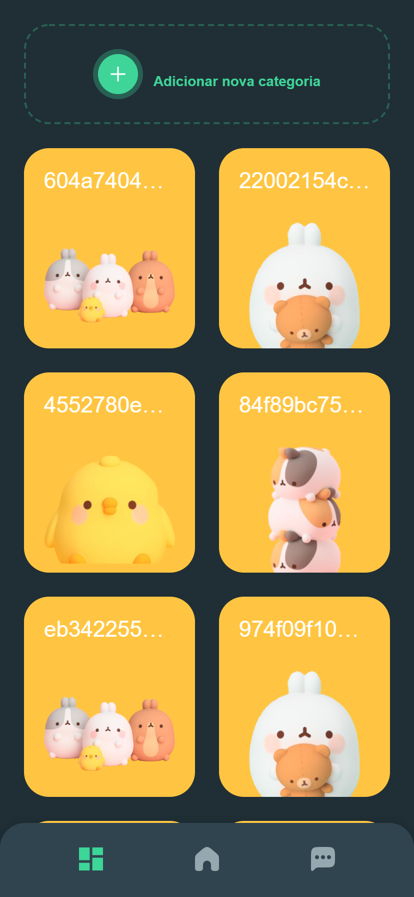
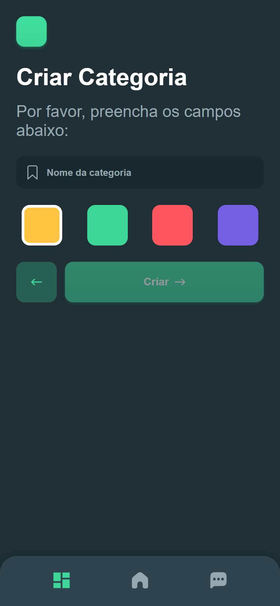
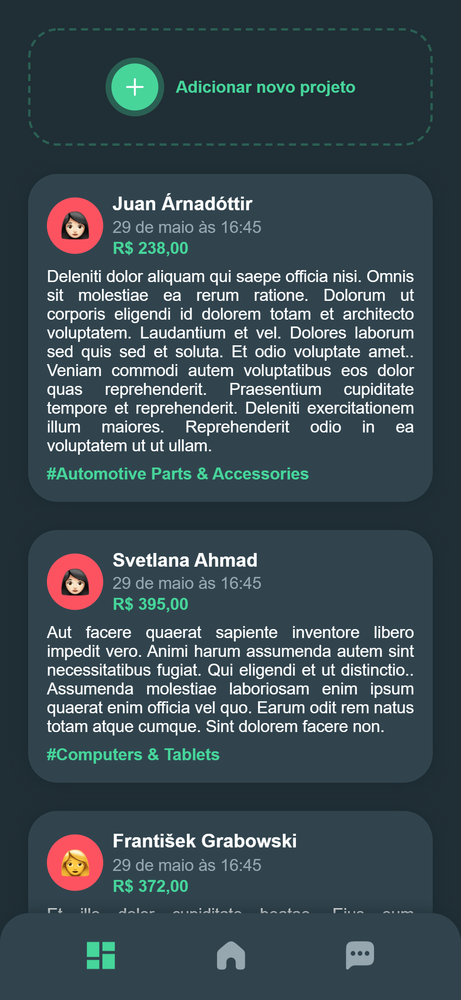
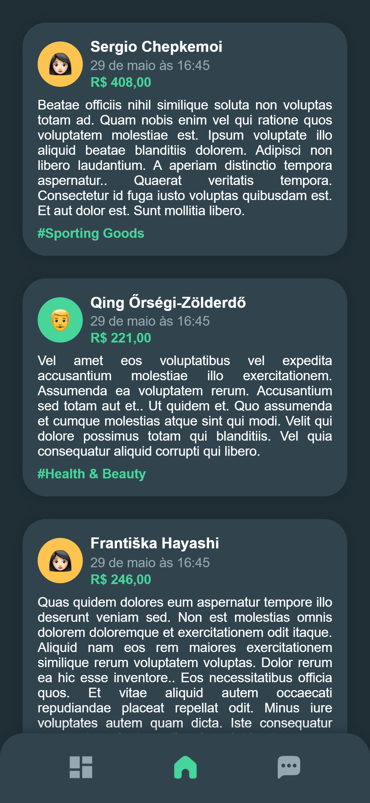
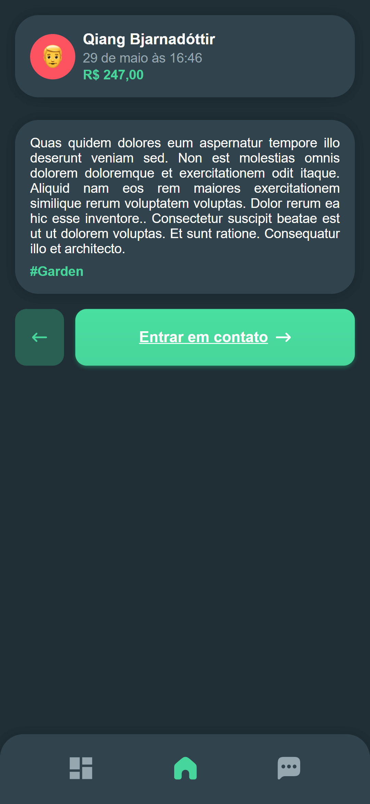
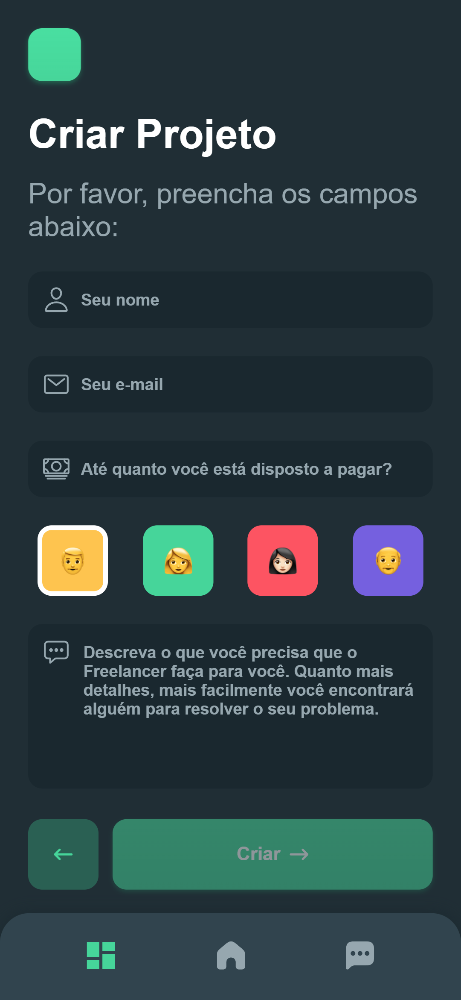
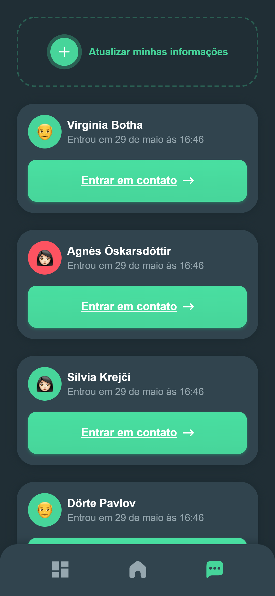
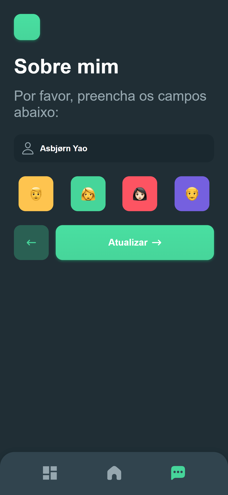

# Projeto Final

Esse repositório irá conter todos os arquivos do projeto final.

## Grupo

- Kennedy Corrêa - 160080 - (PA038TIN1)
- Leonardo P. Bottaro - 180043 - (CP110TIN3)
- Marcelo Zaguette Junior - 180998 - (CP303TIN3 e PA038TIN1)
- Matheus Jesus Tartaglia - 180112 - (CP110TIN3)
- Vinícius Lourenço Claro Cardoso - 180618 - (CP110TIN3)

## Aplicativo

Para saber como rodar e ver o código do aplicativo, vá em [/app](./app).

## Telas

Você pode acessar o figma do projeto [clicando aqui](https://www.figma.com/file/0OImYkLWZf3ugts9ERaad4/Freelance-App).

  
Tela de Entrar

  

  
Tela de Criar Conta

  

  
Tela de Categorias

  

  
Tela de Criar Categorias

  

  
Tela de Listagem de Projetos por categoria

  

  
Tela de Listagem de Projetos

  

  
Tela de Visualização de um Projeto

  

  
Tela de Adicionar um Projeto

  

  
Tela de Listar Freelancers

  

  
Tela de Sobre Mim

  

